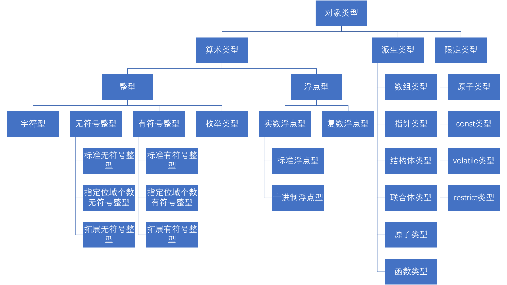

# 前言

GB/T 29076-2021 航天产品质量问题归零实施要求

定位准确是前提

机理清楚是关键

问题复现是手段

措施有效是核心

举一反三是延伸

过程清楚是基础

责任明确是前提

措施落实是核心

严肃处理是手段

完善规章是结果

# 对象(object)和标识符(identifier)

## 定义

region of data storage,the contents of which can represent values(数据存储区域,其内容可表示数值)

objects are composed of contiguous sequences of one or more bytes(对象由一个或多个字节的连续序列组成)

## 对象元组模型

Address:这一段内存lowest字节的编号

Object_Type:对象类型

Name:对象名称

Size:内存大小(字节数量)

Object Value:对象的值

Alignment:对齐要求

Value:对象的表示值

Value Type:表示值类型

Object Representation:对象表示

Storage Duration:存储周期

## 标识符元组模型

Name:标识符名称

Linkage:链接

Scope:作用域

Namespace:命名空间

# 常量

C语言标准规定五种常量,分别为整数常量、浮点常量、枚举常量、字符常量、预定义常量

## 量前缀后缀

无编码、u8、u、U、L对于string literal前缀,编码规则参见第3课P26

无、U、L、LL、WB、UL/LU、ULL/LLU、UWB/WBU对于整数常量后缀,后缀含义参见第3课P75-79

无、f / F、l / L、df / DF、dd / DD、dl / DL对于浮点常量后缀,后缀含义参见第3课P82

无、u8、u、U、L对于字符常量前缀,前缀含义参见第4课P10

# 分配对象四种方式

## Initializer(初始化器或对象标识符定义,更准确地说,此处为Declaration(声明))

Storage Duration:static/automatic/thread

名称:存在

## String Literal(字符串字面量)

Storage Duration:static

名称:匿名

## Compound Literal(复合字面量)

Storage Duration:static/automatic

名称:匿名

## 内存管理函数

Storage Duration:allocated

名称:匿名

## 辨析

复合字面量的语法形式为(type){content},字符串字面量的语法形式为"content",它们独立时都分配对象,但initialize时使用{content,content...}语法,抽象机会识别成初始化列表,不分配对象;使用""语法,抽象机会识别成字符串字面量,分配对象

因此,char str[]="content"分配两次对象,一次匿名对象,一次具名对象,二者存在复制关系;char *p="content"分配两次对象,一次匿名对象,一次指针对象,二者存在designate关系(其行为详见表达式)

# 对象类型

## 第一种分类

算术类型、派生类型、限定类型

## 第二种分类

基础类型

基础类型含字符型、无符号整型、有符号整型、浮点型

## 第三种分类

字符相关类型

字符相关类型含字符型、有符号字符型、无符号字符型

## 第四种分类

标量类型

标量类型含算术类型、指针类型、nullptr_t(值唯一,为预定义常量nullptr)

## 第五种分类

完全对象类型、不完全对象类型

不完全对象类型含void、T Identifier[]、内容未指定的结构体或联合体;其余均为完全对象类型

## 第六种分类

对象类型、函数类型

# 对齐要求

## 定义

对象地址能被对齐要求整除;类型本身没有大小和对齐要求,只有对象才有

## 性质

类型的对齐要求是缺省(默认,default)的;

对象的对齐要求一定满足2^n;

字符相关类型的对齐要求最弱;

数组类型对齐要求为其元素类型对齐要求;

不完全类型没有对齐要求;

alignof(struct) = max(alignof(逐成员,注意非逐类型));

限定类型不改变对齐要求,原子除外;所有指针类型对齐要求相同;

每对象可使用_Alignas()设置更大对齐,但不改变类型本身的对齐要求和对象大小;

## fundamental alignment相关

fundamental alignment是编译器必须支持的对齐(集合);

fundamental alignment(逐元素) <= alignof(max_align_t);

max_align_t是一个元素,拥有最大fundamental alignment元素;

malloc对象对齐 = alignof(max_align_t)

## struct的internal paddings和trailing paddings算法

此处应有例

# Storage Duration

## 定义

任何一个对象都有生命周期(lifetime),决定生命周期的就是对象的Storage Duration

在生命周期内,系统确保对象的内存有效;在对象生命周期内,地址不变;对象保有最后赋值(last-stored value)不变

超出对象生命周期之外对对象的访问是未定义行为

## static

初始化值:+0

生命周期:进程

释放:进程结束

对象类型:有

初始化时机:进程开始前(program startup),仅一次

## automatic

初始化值:indeterminate

生命周期:block

释放:block结束

对象类型:有

初始化时机:对象声明(Object Declaration)

## allocated

初始化值:indeterminate

生命周期:从malloc等到free

释放:free()

对象类型:无

初始化时机:malloc

## thread

初始化:+0

生命周期:线程

释放:线程结束

对象类型:有

初始化时机:线程开始前,每线程一次

# 链接

## 定义

An identifier declared in different scopes or in the same scope more than once can be made to refer to the same object or function by a process called linkage.(在不同作用域或同一作用域中多次声明的标识符,可以通过一种称为链接的过程使其指向同一个对象或函数)

## No Linkage

The following identifiers have no linkage:

1.an identifier declared to be anything other than an object or a function(声明的不是对象也不是函数);

2.an identifier declared to be a function parameter(函数参数);

3.a block scope identifier for an object declared without the storage-class specifier extern(block scope中声明的对象标识符,且没有extern修饰).

## Internal Linkage

如果一个对象标识符拥有file scope,且被static或constexpr修饰,则该标识符internal linkage

如果一个函数标识符拥有file scope,且被static修饰,则该标识符internal linkage

## External Linkage

For an identifier declared with the storage-class specifier extern in a scope in which a prior declaration of that identifier is visible, if the prior declaration specifies internal or external linkage, the linkage of the identifier at the later declaration is the same as the linkage specified at the prior declaration. If no prior declaration is visible, or if the prior declaration specifies no linkage, then the identifier has external linkage(对于在某个scope中用extern声明(注意:显式)的标识符,如果该scope中存在该标识符的先前声明可见,若先前声明是internal或external linkage,沿用先前声明的linkage;若没有可见的先前声明,或若先前声明是no linkage,则external linkage)

If the declaration of an identifier for a function has no storage-class specifier, its linkage is determined exactly as if it were declared with the storage-class specifier extern(如果函数标识符的声明没有storage-class specifier,其linkage的确定方式完全等同于它被声明为extern).

The declaration of an identifier for a function that has block scope shall have no explicit storage-class specifier other than extern(在block scope中声明的函数标识符,除extern外不得有任何显式的storage-class specifier).

补充:file scope object identifier,无storage-class specifier,则external linkage

## 暂定定义

对file scope的对象标识符声明,无initializer、无extern/thread_local则构成暂定定义

## 例

此处应有例

# 作用域和命名空间(待理解)

## 作用域

C语言一共有四种Scope作用域:function(goto标签),function prototype(函数声明参数列表),file,block

## 命名空间

1.label name(goto标签)

2.tag(结构体、联合体、枚举标签)

3.member of structures or unions(结构体、联合体成员)

4.standard attributes and attribute prefixes

5.trailing identifier in an attribute prefixed token

6.ordinary identifiers(对象、函数等)

## 规则

一个标识符作用域、命名空间完全相同则冲突,除了暂定定义和后者显式extern沿用(考察linkage)

# 数组、指针、限定类型派生

## 引

派生:以源为派生者之成员

不完全对象类型无法充当源(成员)派生

## 从数组到数组

以int[m]派生int[n][m],代表int[n]数组成员为int[m]

## 从指针到指针

以int\*派生int**,代表int*所指成员类型为int*

## 从指针到数组

以int\*派生int*[n],代表int[n]数组成员为int*

## 从数组到指针

以int[n]派生int(\*)[n],代表int*所指成员类型为int[n]

## 如何确定一个类型是数组类型还是指针类型?

指针类型去除*后为其成员类型,数组类型去除[]后为其成员类型

括号内优先识别,[]大于*

MyType*[]表示数组类型,成员为MyType

MyType*\*表示指针类型,成员为MyType*

MyType[n][m]表示数组类型,成员为MyType[m]

## 限定类型派生

### T、T[N]和T*时，Q在等号左边右边的区别

1.当T是语法上整体,限定符在T(普通、数组、指针)的左边右边都一样

2.数组类型:T[N]

Q T[N]:数组类型,元素类型Q T,元素个数N

T[N] Q:不合法

限定符不能直接限定数组类型T[N]

3.指针类型:T*

Q T*:指针类型,Referenced Type是Q T

T* Q:Q限定T*类型

### 基于限定类型派生

限定类型形式Q T,派生数组类型(N个元素):Q T[N],派生指针类型:Q T*

限定类型形式T Q,派生数组类型(N个元素):T Q[N],派生指针类型:T Q*

限定类型形式T* Q,派生数组类型(N个元素):T* Q[N],派生指针类型:T* Q*

限定符不能直接限定数组类型T[N]

1.对于Q T,数组类型就是在T后加[N],指针类型就是在T后加*

2.对于T Q,数组类型就是在Q后加[N],指针类型就是在Q后加*

3.对于T* Q,数组类型就是在Q后加[N],指针类型就是在Q号后加*

### 例

此处应有例

# 表达式(lvalue、non-lvalue)和rvalue和evaluate

## 表达式

1.基础表达式(Primary Expressions)

2.后缀表达式(Postfix Expressions)

3.一元表达式(Unary Expressions)

4.类型转换表达式(Cast Expressions)

5.乘除表达式(Multiplicative Expressions)

6.加减表达式(Additive Expressions)

7.移位表达式(Bitwise Shift Expressions)

8.条件表达式(Relational Expressions)

9.相等表达式(Equality Expressions)

10.按位与表达式(Bitwise AND Expressions)

11.按位异或表达式(Bitwise Exclusive OR Expressions)

12.按位或表达式(Bitwise Inclusive OR Expressions)

13.逻辑与表达式(Logical AND Expressions)

14.逻辑或表达式(Logical OR Expressions)

15.条件表达式(Conditional Expressions)

16.赋值表达式(Assignment Expressions)

17.逗号表达式(Comma Expressions)

注意:object initialize时初始化列表不是表达式,是一种独立的语法结构,不evaluate,但initialize允许初始化列表和表达式

## 表达式evaluate规则

给定一个表达式(Expression),Evaluate过程包括:

1.Value Computation(计算值)

2.Initiation of Side Effect(确定副作用)

Value Computation:得到这个表达式的rvalue,以及rvalue的类型

rvalue在标准中也被称为value of expression

Side Effect:环境状态的改变(changes in the state of the execution environment)

注意:lvalue表达式包含于表达式,另有non-lvalue表达式(算术运算、赋值表达式等),non-lvalue在计算值和确定副作用行为与lvalue表达式不同(计算值:Usual Arithmetic Conversions等;确定副作用:赋值表达式等)

## lvalue表达式

1.对象标识符

2.数组下标运算表达式

3.*exp

4.String Literal(字符串字面量)

5.Compound Literal

6.指向结构体/联合体的lvalue.member

7.指向结构体/联合体指针表达式->member

注意:string literal是lvalue表达式,定位char[]对象,不是常量

## lvalue表达式evaluate规则

给定一个lvalue表达式,如果这个lvalue进行evaluate

1.Value Computation(计算值)

1.1 如果lvalue定位的对象是一个非数组对象类型,则lvalue表达式evaluate之后的rvalue就是该对象的对象值,rvalue类型是该对象类型的非限定类型,该过程被称为lvalue conversion(左值转换)

1.2 如果lvalue定位的对象是一个数组对象类型,则lvalue表达式evaluate之后的rvalue就是该对象第一个元素的首地址,rvalue类型是元素对象类型对应的指针类型,该过程被广泛称为decay(退化,非标准术语)

2.Side Effect(确定副作用)

无

## 定位非数组对象的lvalue的evaluate规则

给定一个能定位非数组对象的lvalue表达式exp,如果这个表达式

1.跟sizeof结合,例如:sizeof(exp),或sizeof exp

2.跟typeof结合,例如:typeof(exp),typeof_unqual(exp)

3.跟&结合,例如:&exp

4.跟一元运算符++/--和后缀运算符++/--结合,例如:++exp/--exp/exp++/exp--

5.如果lvalue定位的对象类型是结构体/联合体,跟.结合,例如:exp.

6.出现在赋值运算符的左侧,例如:exp=

除了以上6种情况,这个表达式都要做evaluate

## 定位非数组对象lvalue的evaluate示例,结合对象元组模型

1.sizeof,定位Address,得Size

2.typeof,定位Address,得Object_Type

3.&a,定位Address,得Adddress和Object_Type*

4.++a/--a,定位Address,得Object_Value,返回Object_Value+1

5.a++/a--,定位Address,得Object_Value,返回Object_Value

6.alignof,定位Address,得Alignment

7.a=x,定位Address,得Object_Value,返回x右值,副作用为将a的Object_Value改为x

## 定位普通(Non-VLA)数组对象的lvalue的evaluate规则

给定一个能定位普通数组对象的lvalue表达式exp,如果这个表达式

1.跟sizeof结合,例如:sizeof(exp),或sizeof exp

2.跟typeof/typeof_unqual结合,例如:typeof(exp)

3.跟&结合,例如:&exp

4.如果lvalue定位的是一个string literal,且用于初始化一个字符数组,例如:char str[]="hello",这个hello是一个lvalue,并初始化字符数组str

除了以上4种情况,这个表达式都要做evaluate

## 定位普通(Non-VLA)嵌套数组对象lvalue的evaluate示例

以int array[1][1]简单一层嵌套为例

1.array,定位Address,得<Value, Value_Type>

2.sizeof,定位Address,得Size(数组的Size,递归到标量等)

3.typeof,定位Address,得Object_Type

4.&array,定位Address,得Adddress和Object_Type*

5.alignof,定位Address,得Alignment(成员的Alignment,递归到标量等)

## 不可修改左值

给定一个lvaule表达式,这个lvalue定位一个对象的对象类型T:

1.T是数组类型

2.T是const限定类型

3.T是不完全对象类型

4.T是结构体/联合体成员,其成员对象类型有const限定类型

则称这个lvalue为不可修改左值,其他lvalue被称为可修改左值

## Usual Arithmetic Conversions(常规/常用/标准算术转换,规定部分non-lvalue表达式行为)

### 定义

当有表达式涉及多个算术类型子表达式,该机制决定算术类型子表达式rvalue类型转换规则,并决定整个表达式rvalue类型如何获得

### 浮点数

如果一个operand是decimal floating type,另一个operand也必须是decimal floating type,确保十进制浮点数不和非十进制浮点数一起运算

_Decimal128 > _Decimal64 > _Decimal32,long double > double > float,向高提升

### 整数

#### Integer Conversion Rank

long long int = unsigned long long int >

long int = unsigned long int >

int = unsigned int >

short int = unsigned short int >

signed char = unsigned char = char >

bool

#### operand类型小于int/unsigned int规则

bool、signed char、unsigned char、signed short、unsigned short

operand如果是以上类型

1.如果int类型能表征,转换成int类型

2.如果int类型不能表征,转换成unsigned int类型

#### Integer Promotion

1.如果两个operand都是有符号或者都是无符号,less rank的operand向greater rank转换

2.如果无符号类型operand的rank大于等于另一个有符号operand的rank,有符号operand转换成无符号operand的类型

3.如果有符号operand的类型表征范围能覆盖另一个无符号operand类型的表征范围,无符号operand转换成有符号operand类型

4.两个operand都转成有符号operand类型对应的无符号类型

# Sequence

## Sequence Before

A sequenced before B的含义是A的evaluation在B的evaluation之前;与A相关的Valuation Computation和side effects全部在与B相关的Valuation Computation和side effects之前;其中A和B为左值表达式

## Sequence Point(序列点)

A sequence point B保证A sequenced before B;其中A和B为左值表达式;序列点前的object designate和lvalue conversion,编译器可以自由安排

1.Function Designator和实参的evaluation,和实际函数调用执行之间

2.在&&、||、逗号运算符分隔的前后两个表达式之间

3.?:三目运算表达式中,?之前表达式以及之后执行的表达式之间

4.两个full expression之间,full expression包括例如:表达式语句(分号)、if、switch、while、do的控制语句、return(exp)中的exp,for(exp1;exp2;exp3)中的expi,变长类型的声明,非compound literal中的initializer

5.库函数调用返回之前

6.printf/scanf、fpritnf/fscanf、sprint/sscanf等按转换说明符执行完转换动作之后

7.bsearch，qsort等比较函数调用之前和之后以及调用比较函数和对象移动之间

## UB(Undefined behavior,未定义行为)

### 定义

If a side effect on a scalar object is unsequenced relative to either a different side effect on the same scalar object or a value computation using the value of the same scalar object, the behavior is undefined.(对同一个标量对象,两次副作用之间无顺序则UB;副作用和取值之间无顺序则UB)

等等

### 例

++i + ++i(对同一个标量对象,两次副作用之间无顺序)

a[i++] = i和a[++i] = i(副作用和取值之间无顺序)

int const a; int* p = (int*)&a; *p = ...;(const限定撤除)

"helloworld"[0] = 'a'(修改string literal)

register int array[]和register int a; int* p = &a;(register数组/register对象取址)

strcpy(str, str+1)(restrict重叠复制)

# 运算符*、&、[]、->和指针与整数之间加减(Referenced与Pointer相关机制)

## *的语义

假设对表达式exp进行evaluate，rvalue为<Value, Value_Type>,如果Value_Type是一个对象指针类型,则可以用\*exp的方式来定位一个对象M,该对象的Address为Value,该对象的Object Type为Value_Type对应的Referenced Type,对象其他属性随之确定,\*exp是一个lvalue,定位一个对象,仅此而已,不是获得*exp这个表达式的值,表达式的值只有在evaluate之后才有

## &的语义

designate一个object,返回<Address, Object_Type*>,不做evaluate

## []的语义

任何一个表达式exp，只要这个表达式返回值类型是一个对象指针类型,则

*(exp+n) <=> exp[n]

exp1[exp2] <=> exp2[exp1]

给定两个表达式,只要其中一个表达式evaluate后rvalue的类型是一个有效的对象指针类型,而另一个表达式evaluate后rvalue的类型是一个合法的整数类型,则这两个表达式就可以用[]的方式进行对象定位,但C语言并没有规定哪一个必须放在[]里面

## ->的语义

略

## 指针加减

### 加

假设对表达式exp1进行evaluate,rvalue为<Value, Value_Type>(任何表达式都有rvalue)

假设对表达式exp2进行evaluate,rvalue的value_type为一个整数类型

则：exp1+exp2/exp2+exp1这个表达式的rvalue结果为:

<Value+exp2*sizeof(*exp1), Value_Type>

由于exp1+exp2或exp2+exp1这个表达是的rvalue的类型依然是一个对象指针类型

\*(exp1+exp2)或者*(exp2+exp1)依然可以用之前*exp的规则来定位一个对象

将exp1+exp2或者exp2+exp1视做exp即可

### 减

指针与整数:

假设对表达式exp1进行evaluate,rvalue为<Value, Value_Type>(任何表达式都有rvalue)

假设对表达式exp2进行evaluate,rvalue的value_type为一个整数类型

则:只能exp1-exp2,或者视为exp1+(-exp2)或(-exp2)+exp1

指针与指针:

1.相减的两个指针类型必须一致

2.假设p: <Value1, int*>, q: <Value2, int*>

p – q: <(Value1-Value2)/sizeof(*p), ptrdiff_t>

注意两个指针相减的表达式的rvalue类型为ptrdiff_t

## 数组对象+n的offset计算,嵌套数组[][][]...offset计算

此处应有例

# VLA(variable length array,变长数组)

## 常量表达式

1.常量表达式不能包含赋值、自增/自减、函数调用、逗号运算符,除非他们包含在不被evaluate的子表达中

2.常量表达式evaluate之后的rvalue的取值范围,应该在该表达rvalue类型的表征范围之内

## 整数常量表达式

一个表达式exp,满足以下条件是整数常量表达式

1.表达式rvalue类型为整数类型

2.operand是

(1)整数常量

(2)字符常量

(3)类型为整数的named constant

(4)类型为整数的compound literal constant

(5)rvalue类型是整数常量的sizeof表达式

(6)alignof表达式

(7)cast表达式，其中cast的子表达式是浮点常量、类型为算术类型的named constant、compound literal constant,除非该cast表达式是typeof、sizeof或alignof操作符的operand

## VLA

T[M],其中(M不是一个整数常量或者整数常量表达式)||(T是一个变长数组)

## VLA与sizeof

### sizeof后exp

sizeof后面可以跟两种operand,type-name和exp

1.sizeof(type-name)

1.1 type-name是非VLA type

1.2 type-name是VLA type

2.sizeof(exp) / sizeof exp

2.1 sizeof(lvalue-exp) / sizeof lvalue-exp

2.1.1 lvalue是非数组类型

2.1.2 lvalue是普通数组类型

2.1.3 lvalue是VLA类型

2.2 sizeof(non-lvalue-exp) /sizeof non-lvalue-exp

### sizeof(type-name)

1.如果type-name是Non-VLA,则sizeof(type-name)在编译时得到type-name的大小,其返回值是整数常量,type-name作为operand,整体不做evaluate

2.如果type-name是VLA,则sizeof(type-name)不能在编译时得到type-name的大小,其返回值不是整数常量,需要在运行时得到类型大小,type-name作为operand，子表达式需要evaluate

### sizeof(lvalue)

1.如果lvalue定位的对象类型是Non-VLA,则sizeof(lvalue)在编译时得到lvalue定位对象的大小,其返回值是整数常量,lvalue作为operand,整体不做evaluate

2.如果lvalue定位的对象类型是VLA,则sizeof(lvalue)不能在编译时得到lvalue定位对象的大小,其返回值不是整数常量,需要在运行时得到对象大小,意味着lvalue作为operand,子表达式需要evaluate

### sizeof(non-lvalue)

如果表达式是一个non-lvalue,则sizeof(non-lvalue)返回这个non-lvalue做evaluate之后rvalue类型的大小,这个non-lvalue并不会真的做evaluate

注意:对于一个数组对象,当其作为非左值表达式(如四则运算)的子表达式,它将不触发evaluate,如sizeof(a[m]+1)=sizeof(int),其中int a[m][n]={0};

# Storage-class Specifiers

## 注意

Storage-class Specifiers不是Type Qualifier(const、volatile、restrict、_Atomic)

## 种类

auto、constexpr、extern、register、static、thread_local、typedef

## 限制

一般来说,对象标识符声明(Object Identifier Declaration)的时候,Storage-Class Specifier只能有一个,除了:

1.thread_local可以和static或extern同时出现

2.auto可以跟除了typedef的其他Specifier同时出现

3.constexpr可以跟auto，register或static同时出现

## 作用

Storage-Class Specifier规定了标识符(Identifier)的不同属性

1.storage duration:thread_local,auto,register,以及block scope中的static

2.linkage:extern,file scope中的static和constexpr,typedef

3.object value and type:constexpr

4.type:typedef

# 散记(待补)

## 地址常量

地址常量的指的是:

1.空指针

2.指向一个static storage duration的对象的指针

3.指向Function Designator的指针

地址常量的获得方法包括:

1.显式使用一元操作符&来获得的rvalue

2.显式将整数常量强制转换成指针类型获得的rvalue

3.隐式使用数组类型表达式获得的rvalue

4.隐式使用函数类型表达式获得的rvalue

注意:使用一个指针类型对象指向另一个对象,前者被evaluate获得的rvalue不算地址常量

## 内存基础

n位地址总线访字节地址数为2^n

1B(字节)>=8bit

## volatile

MMIO(Memory-Mapped Input/Output)中,内存和I/O设备共享同一个地址空间,会给各种I/O设备预留出相应的地址区域,一个地址可能访问内存,也可能访问某个I/O设备,某一个I/O设备对应的映射地址的值就可能因为硬件的行为而改变,这种改变对于程序来说是不可知的(Unknown)

volatile对象如果要evaluate,都必须去访问对应的内存

C语言标准规定如果编译器能推断出一个表达式无效,也可以选择不evaluate这个表达式,即使这个表达式包括volatile的对象

## restrict

restrict只能限定对象指针类型,或者对象指针类型构成的嵌套数组类型

T* restrict O=initializer;

表达式O能够定位一个对象Obj(也可以称为对象O),对象类型为T* restrict

注意表达式O和对象O的区别

1、对象O的值是T*类型，蕴含着一个数组访问

表达式O做Evaluate之后的值就是Obj的值

O[n]可以用来访问数组的任意元素对象

T* restrict O;

表达式O能够定位一个对象Obj(也可以称为对象O),对象类型为T* restrict

注意表达式O和对象O的区别

2、给定表达式E，evaluate之后是一个指针类型的值，如果对象Obj的值修改，

表达式E被evaluate之后的值也会被修改，则

E Based on Obj

表达式O Based on对象O

restrict的作用

在一个Block里面

1.如果有一个左值表达式L，&L表达式是Based on一个对象P

2.该左值表达式L其定位的对象假设为X，如果X对象的值会被修改

3.有另一个左值表达式M能访问X，则M的地址也必须based on对象P

## register

register T O

告诉编译器越快越好，但编译器可以不理会

register修饰的对象不能取地址

register修饰数组对象:未定义行为(因为数组对象evaluate之后,应该是第一个元素的首地址,但是register的对象没有地址,因此有问题)

## auto

auto O = initializer;

Initializer必须有,且只能是赋值表达式或更高优先级表达式

对象O的类型是initializer这个表达式rvalue的类型

auto不是指对象的存储周期为automatic

## constexpr

constexpr的对象值是编译时常量,可以作为数组大小、枚举值等

## typeof_unqual

typeof_unqual(type)获得type非限定类型

## 字符串相邻合并语法

"hello" " " "world"  ⇔  "hello world"

## 字符常量类型

字符常量类型为int,C与C++不同

## 枚举底层类型

enum Season : int {enum1, enum2,...};其中int显式指定底层类型

若不指定,由编译器在char和整数类型中选

## 枚举数字修改

enum myenum {enum1=2, enum2, enum3=5, enum4...};

此时enum2=enum1+1,enum4=enum3+1,显式规定为标准,后者+1,后n者加n(除非显示规定)

rvalue类型依然是enum myenum

## typedef语法(待补)

## 散散的记

因为结课了所以摆烂不想写了orz 把之前注意到的一些直接写这里

sizeof(匿名对象)不分配对象 编译时推断

所有指针对象都蕴含数组访问 越界为UB

前++后++对object_value+1都是副作用 它们返回object_value+1或object_value 虽然它们有返回值 但这并不代表它们是左值表达式 前面提到进行表达式(无论左值非左值)的过程有计算值和副作用两种 打比方单独进行a+b虽然a和b左值转换 但是+不会左值转换 它literally仍返回a+b的值 也就是说不是只有左值表达式才有返回值(右值) 是一个表达式都会有右值 非左值表达式也会

等号左边的对象标识符一定是左值且不发生左值转换 这对吗?可以想到array[]=...需要对array进行evaluate,但是对array进行evaluate的定义是数组的decay,而不是lvalue conversion,所以等号左边不发生左值转换是对的;decay和lvalue conversion都是左值表达式求值的结果,如果说等号左边的对象标识符一定是左值且不发生evaluate这就错了,对于普通对象确实不用evaluate,只用designate,但数组对象特殊,数组对象作为索引运算的子表达式,evaluate(decay)是为[]提供指针,而不是和普通对象那样可以直接designate到偏移的对象,故需要对数组对象进行evaluate,进一步对整体表达式(索引表达式、运算)所指对象designate

另一个未定义行为之修改string literal,当进行"hello"[0]='a'或者char* p="hello"后p[0]=...都属于这种情况,课上没详细讲为何UB,但实践很明确string literal可能(或总是)分配在只读内存区如.rodata段,这才是为什么实践选择char p[]="hello"对一个在只读内存区的string literal进行复制(抽象机语境下string literal会被留着,但编译器也许会后续优化,取决于编译器行为)

是否声明的对象就在栈 手动用内存管理函数分配allocated的对象就在堆?不一定,这是常用操作系统实践,理论上存在实践上也可行写一个os把所有对象都丢同一块内存区域